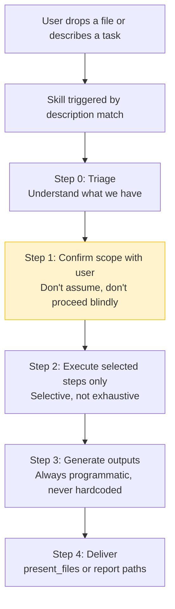
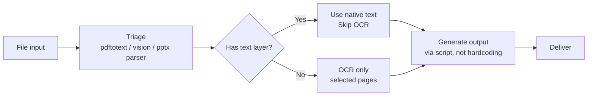
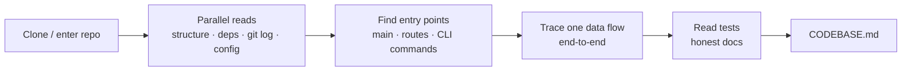
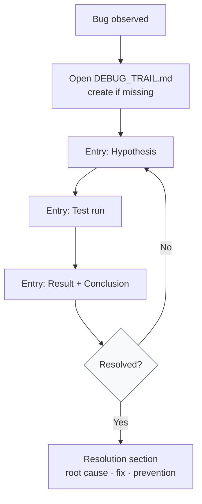
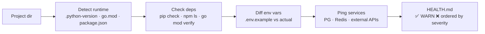

# agent-skills

Workflow skills for Claude Code. Each skill is a `SKILL.md` file that guides an
agent through a multi-step task — with user confirmation gates, structured output
templates, and anti-patterns encoded from real sessions.

> **Related:** [agent-mcps](https://github.com/Sakethv7/agent-mcps) — MCP servers
> that expose the underlying tools (OCR, notebooks, git, data) these skills use.

---

## How skills work



The confirmation gate at Step 1 is intentional — skills are workflows, not
automations. The agent proposes, the user decides scope, then execution happens.

---

## Skills

### Document processing

| Skill | Trigger phrases | Output |
|---|---|---|
| [scanned-doc-reader](./scanned-doc-reader/) | "OCR this", "make a study guide from this PDF", "extract text" | `STUDY_GUIDE.md`, `CONCEPTS.md`, `viewer.html` (opt-in) |
| [paper-digest](./paper-digest/) | "summarize this paper", "what does this paper claim", "break down this study" | `DIGEST.md` |
| [contract-extractor](./contract-extractor/) | "review this contract", "what am I agreeing to", "extract the key clauses" | `CONTRACT_SUMMARY.md` |
| [receipt-scanner](./receipt-scanner/) | "extract expenses from these receipts", "build an expense report" | `expenses.csv`, `exceptions.txt` |
| [whiteboard-to-notes](./whiteboard-to-notes/) | "transcribe this whiteboard", "turn these notes into markdown" | `NOTES.md` |
| [slide-deck-reader](./slide-deck-reader/) | "summarize this deck", "what is this presentation arguing" | `DECK_SUMMARY.md` |
| [data-profiler](./data-profiler/) | "what's in this file", "profile this data", "analyze this spreadsheet/deck/report" | `INSIGHTS.md` |

### Engineering

| Skill | Trigger phrases | Output |
|---|---|---|
| [repo-onboarder](./repo-onboarder/) | "get familiar with this codebase", "map the architecture", "where do I start" | `CODEBASE.md` |
| [debug-trail](./debug-trail/) | "start a debug trail", "log this session", "track what we're trying" | `DEBUG_TRAIL.md` (append-only, live) |
| [env-doctor](./env-doctor/) | "check if this is set up", "why isn't this running", "is my environment right" | `HEALTH.md` |

---

## Skill flows

### Document skills — shared pattern



### repo-onboarder



### debug-trail



### env-doctor



---

## Install

Copy any skill's `SKILL.md` into your Claude Code skills directory:

```bash
# Single skill
cp repo-onboarder/SKILL.md ~/.claude/skills/repo-onboarder.md

# All skills at once
for dir in */; do
  skill="$dir/SKILL.md"
  [ -f "$skill" ] && cp "$skill" ~/.claude/skills/"${dir%/}.md"
done
```

Then invoke in Claude Code:

```
/repo-onboarder
/debug-trail
/env-doctor
/scanned-doc-reader
/data-profiler
```

---

## Skills vs MCPs

These skills focus on **guided workflows** — they stop and ask before doing expensive
operations (OCR, full codebase reads, full-doc analysis). That's intentional.

For raw, composable tools the agent calls mid-task without a workflow:
→ [agent-mcps](https://github.com/Sakethv7/agent-mcps)

The two repos work well together. Skills use MCP tools when they're connected;
MCP tools are available to any task without explicitly invoking a skill.

---

## Adding a skill

A minimal skill needs a `SKILL.md` with YAML frontmatter:

```yaml
---
name: my-skill
description: >
  What it does and when to trigger it. Be specific about trigger phrases.
  Claude uses this description to decide whether to use the skill.
---

# My Skill

## Step 1 — ...
## Step 2 — ...
```

The description field is the trigger mechanism — make it concrete and include
example phrases a user would actually say.
